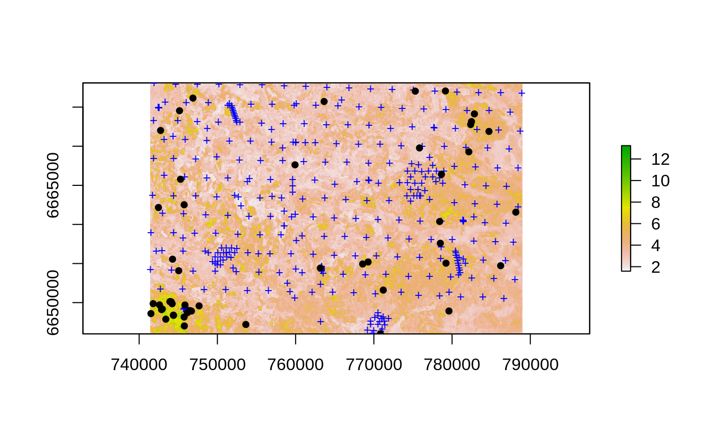
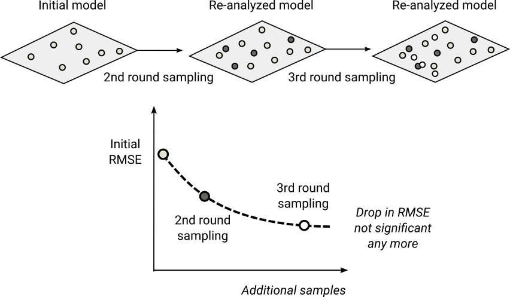

# Generating 2nd, 3rd round sampling

::: {.rmdnote}
You are reading the work-in-progress Spatial Sampling and Resampling for Machine Learning. This chapter is currently draft version, a peer-review publication is pending. You can find the polished first edition at <https://opengeohub.github.io/spatial-sampling-ml/>.
:::


## Uncertainty guided sampling

A sensible approach to improving quality of predictions is to: (a) estimate initial 
ML models, (b) produce a realistic estimate of prediction errors, and (c) revisit 
area and collect 2nd round samples that help at smallest possible costs significantly 
improve predictions. Logical focus of the 2nd round sampling could be thus on minimizing 
the overall prediction errors i.e. revising parts of the study area that shows the 
highest prediction errors / prediction problems (Fig. \@ref(fig:eberg-var-eml)). 
This is exactly procedure that @stumpf2017uncertainty recommend in their paper and 
that they refer to as the _“Uncertainty guided sampling”_. 

The 2nd round Uncertainty guided sampling can be implemented either by:

- Producing a strata based on the prediction error map (e.g. extrapolation areas / areas with highest uncertainty), then sampling only within that strata,
- Using the probability of exceeding threshold mapping accuracy to generate extra sampling points,

In both cases 2nd round points can be then added to the original training dataset and the 
model for the area can then be refitted (this procedure in data science is also referred to as _“re-analysis”_). 
Assuming that our initial model was unbiased, then even few tens of extra points 
could lead to significant reduction in RMSPE. In practice, we might have to also 
organize the 3rd round sampling until we finally reach some maximum possible accuracy [@hengl2018random].

To generate 2nd round sampling for the Edgeroi dataset we can first estimate probability 
of prediction errors exceeding some threshold probability e.g. RMSE=0.2. We first 
load point data and prediction error map produced in the previous example using 
Ensemble Machine Learning:


```r
data(edgeroi)
edgeroi.sp <- edgeroi$sites
coordinates(edgeroi.sp) <- ~ LONGDA94 + LATGDA94
proj4string(edgeroi.sp) <- CRS("+proj=longlat +ellps=GRS80 +towgs84=0,0,0,0,0,0,0 +no_defs")
edgeroi.sp <- spTransform(edgeroi.sp, CRS("+init=epsg:28355"))
```

The probability of exceeding some threshold, assuming normal distribution of prediction 
erros can be derived as:


```r
t.RMSE = 0.2
edgeroi.error = readGDAL("./output/edgeroi_soc_rmspe.tif")
#> ./output/edgeroi_soc_rmspe.tif has GDAL driver GTiff 
#> and has 321 rows and 476 columns
edgeroi.error$inv.prob = 1/(1-2*(pnorm(edgeroi.error$band1/t.RMSE)-0.5)) 
```

next, we can generate a sampling plan using the **spatstat** package and the inverse 
probability of the pixels exceeding threshold uncertainty (`f` argument):


```r
dens.var <- spatstat.geom::as.im(sp::as.image.SpatialGridDataFrame(edgeroi.error["inv.prob"]))
pnts.new <- spatstat.core::rpoint(50, f=dens.var)
```

So the new sampling plan, assuming adding only 50 new points would thus look like this:


```r
plot(log1p(raster(edgeroi.error[c("inv.prob")])))
points(edgeroi.sp, pch="+", cex=.8, col="blue")
points(as(pnts.new, "SpatialPoints"), pch=19, cex=0.8, col="black")
```

<div class="figure" style="text-align: center">

<p class="caption">(\#fig:eberg-pnts-eml)Uncertainty guided 2nd round sampling: locations of initial (+) and 2nd round points (dots).</p>
</div>

This puts much higher weight at locations where the prediction errors are higher, 
however, technically speaking we finish still sampling points across the whole 
study area and, of course, including randomization.

<div class="figure" style="text-align: center">

<p class="caption">(\#fig:scheme-resample)General scheme for re-sampling and re-analysis using uncertainty guided sampling principles.</p>
</div>

By adding 2nd, 3rd round sampling we can imagine that the mapping accuracy / RMSE 
would gradually decrease following a decay function (e.g. `RMSE = b0 * x ^ -b1`) until some 
maximum possible accuracy is achieved. This way soil surveyor can optimize the 
predictions and reduce costs by minimizing number of additional samples i.e. it 
could be considered _the shortest path_ to increasing the mapping accuracy without 
a need to start sampling from scratch.
