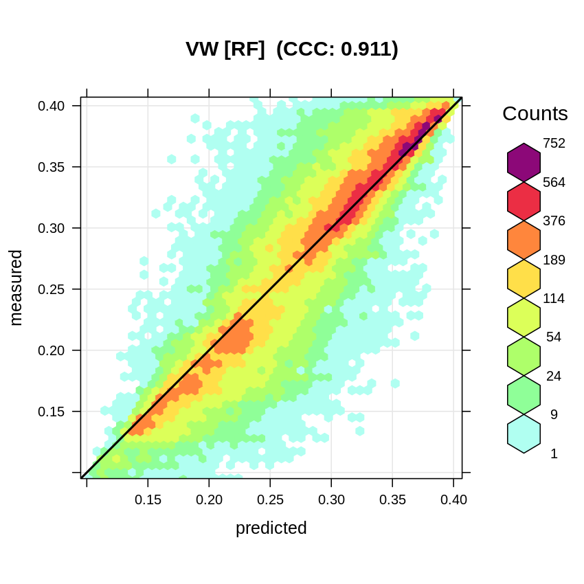
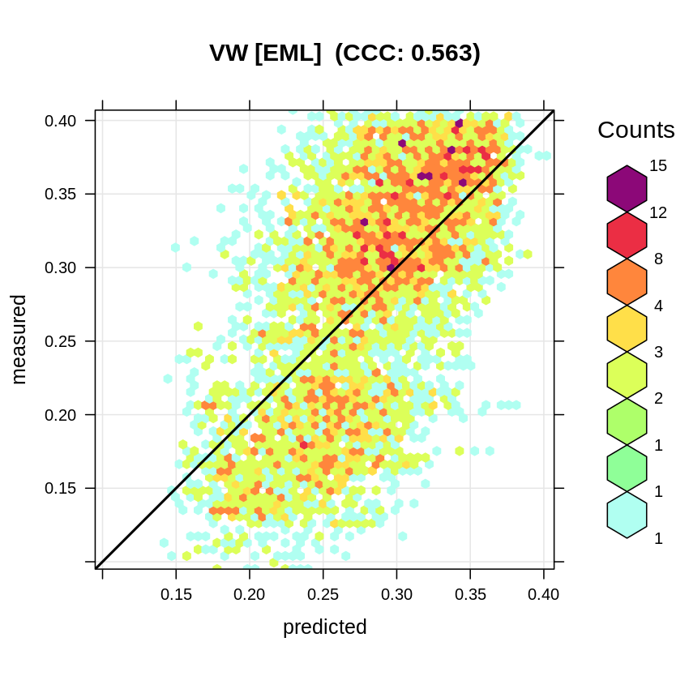

# Resampling for spatiotemporal Machine Learning

::: {.rmdnote}
You are reading the work-in-progress Spatial Sampling and Resampling for Machine Learning. This chapter is currently draft version, a peer-review publication is pending. You can find the polished first edition at <https://opengeohub.github.io/spatial-sampling-ml/>.
:::


## Case study: Cookfarm dataset

We next look at the [Cookfarm dataset](https://rdrr.io/cran/landmap/man/cookfarm.html), which is available via the landmap
package and described in detail in @gasch2015spatio:


```r
library(landmap)
#?landmap::cookfarm
data("cookfarm")
```

This dataset contains spatio-temporal (3D+T) measurements of three soil
properties and a number of spatial and temporal regression covariates.
In this example multiple covariates are used to fit a spatiotemporal model to 
predict soil moisture, soil temperature and electrical conductivity in 3D+T 
(hence 2 extra dimension beyond spatial dimensions i.e. a 2D model).

We can load the prediction locations and regression-matrix from:
  

```r
library(rgdal)
library(ranger)
cookfarm.rm = readRDS('extdata/cookfarm_st.rds')
cookfarm.grid = readRDS('extdata/cookfarm_grid10m.rds')
```

We are specifically interested in modeling soil moisture (`VW`) as a function of soil
depth (`altitude`), elevation (`DEM`), Topographic Wetness Index
(`TWI`), Normalized Difference Red Edge Index (`NDRE.M`), Normalized
Difference Red Edge Index (`NDRE.sd`), Cumulative precipitation in mm
(`Precip_cum`), Maximum measured temperature (`MaxT_wrcc`), Minimum
measured temperature (`MinT_wrcc`) and the transformed cumulative day
(`cdayt`):


```r
fm <- VW ~ altitude+DEM+TWI+NDRE.M+NDRE.Sd+Precip_cum+MaxT_wrcc+MinT_wrcc+cdayt
```

We can use the ranger package to fit a random forest model:


```r
m.vw = ranger(fm, cookfarm.rm, num.trees = 100)
m.vw
#> Ranger result
#> 
#> Call:
#>  ranger(fm, cookfarm.rm, num.trees = 100) 
#> 
#> Type:                             Regression 
#> Number of trees:                  100 
#> Sample size:                      107851 
#> Number of independent variables:  9 
#> Mtry:                             3 
#> Target node size:                 5 
#> Variable importance mode:         none 
#> Splitrule:                        variance 
#> OOB prediction error (MSE):       0.0009826038 
#> R squared (OOB):                  0.8479968
```

which shows that a significant model can be fitting using this data with
R-square about 0.85. The accuracy plot shows that the [Concordance Correlation Coefficient (CCC)](https://rdrr.io/cran/yardstick/man/ccc.html) 
is high:


```r
vw.b = quantile(cookfarm.rm$VW, c(0.001, 0.01, 0.999), na.rm=TRUE)
plot_hexbin(varn="VW_RF", breaks=c(vw.b[1], seq(vw.b[2], vw.b[3], length=25)), 
      meas=cookfarm.rm$VW, pred=m.vw$predictions, main="VW [RF]")
```

<div class="figure" style="text-align: center">

<p class="caption">(\#fig:ac-vw1)Accuracy plot for soil moisture content fitted using RF.</p>
</div>

This model, however, as shown in @gasch2015spatio, ignores the fact that many 
`VW` measurements have exactly the same location (monitoring station with four 
depths), hence ranger over-fits data and gives unrealistic R-square.
We can instead fit an Ensemble ML model, but we will also use a **blocking
parameter** that should protect from over-fitting: the unique code of
the station (`SOURCEID`). This means that **complete stations** will be
either used for training or for validation. This satisfies the
requirement of @roberts2017cross for predicting to new data or predictor
space by blocking clustered or overlapping measurements.

We use the same procedure in `mlr` as in the previous example:


```r
library(mlr)
SL.lst = c("regr.ranger", "regr.gamboost", "regr.cvglmnet")
lrns.st <- lapply(SL.lst, mlr::makeLearner)
## subset to 5% to speed up computing
subs <- runif(nrow(cookfarm.rm))<.05
tsk.st <- mlr::makeRegrTask(data = cookfarm.rm[subs, all.vars(fm)], target = "VW", 
                            blocking = as.factor(cookfarm.rm$SOURCEID)[subs])
tsk.st
#> Supervised task: cookfarm.rm[subs, all.vars(fm)]
#> Type: regr
#> Target: VW
#> Observations: 5321
#> Features:
#>    numerics     factors     ordered functionals 
#>           9           0           0           0 
#> Missings: FALSE
#> Has weights: FALSE
#> Has blocking: TRUE
#> Has coordinates: FALSE
```

The resulting model again used simple linear regression for stacking
various learners:
  

```
#> Starting parallelization in mode=socket with cpus=32.
#> Exporting objects to slaves for mode socket: .mlr.slave.options
#> Mapping in parallel: mode = socket; level = mlr.resample; cpus = 32; elements = 10.
#> Exporting objects to slaves for mode socket: .mlr.slave.options
#> Mapping in parallel: mode = socket; level = mlr.resample; cpus = 32; elements = 10.
#> Loading required package: mboost
#> Loading required package: parallel
#> Loading required package: stabs
#> 
#> Attaching package: 'stabs'
#> The following object is masked from 'package:mlr':
#> 
#>     subsample
#> The following object is masked from 'package:spatstat.core':
#> 
#>     parameters
#> This is mboost 2.9-2. See 'package?mboost' and 'news(package  = "mboost")'
#> for a complete list of changes.
#> 
#> Attaching package: 'mboost'
#> The following object is masked from 'package:glmnet':
#> 
#>     Cindex
#> The following object is masked from 'package:spatstat.core':
#> 
#>     Poisson
#> The following objects are masked from 'package:raster':
#> 
#>     cv, extract
#> Exporting objects to slaves for mode socket: .mlr.slave.options
#> Mapping in parallel: mode = socket; level = mlr.resample; cpus = 32; elements = 10.
#> Stopped parallelization. All cleaned up.
```

Note that here we can use full-parallelisation to speed up computing by 
using the `parallelMap` package. This resulting EML model now shows a 
more realistic R-square / RMSE:


```r
summary(eml.VW$learner.model$super.model$learner.model)
#> 
#> Call:
#> stats::lm(formula = f, data = d)
#> 
#> Residuals:
#>       Min        1Q    Median        3Q       Max 
#> -0.188277 -0.044502  0.003824  0.044429  0.177609 
#> 
#> Coefficients:
#>                Estimate Std. Error t value Pr(>|t|)    
#> (Intercept)    0.044985   0.009034   4.979 6.58e-07 ***
#> regr.ranger    1.002421   0.029440  34.050  < 2e-16 ***
#> regr.gamboost -0.664149   0.071813  -9.248  < 2e-16 ***
#> regr.cvglmnet  0.510689   0.052930   9.648  < 2e-16 ***
#> ---
#> Signif. codes:  0 '***' 0.001 '**' 0.01 '*' 0.05 '.' 0.1 ' ' 1
#> 
#> Residual standard error: 0.06262 on 5317 degrees of freedom
#> Multiple R-squared:  0.3914,	Adjusted R-squared:  0.3911 
#> F-statistic:  1140 on 3 and 5317 DF,  p-value: < 2.2e-16
```

The accuracy plot also shows the CCC to be almost 40% smaller than if no blocking 
is used:


```r
plot_hexbin(varn="VW_EML", breaks=c(vw.b[1], seq(vw.b[2], vw.b[3], length=25)), 
      meas=eml.VW$learner.model$super.model$learner.model$model$VW, 
      pred=eml.VW$learner.model$super.model$learner.model$fitted.values, 
      main="VW [EML]")
```

<div class="figure" style="text-align: center">

<p class="caption">(\#fig:ac-vw2)Accuracy plot for soil moisture content fitted using Ensemble ML with blocking (taking complete stations out).</p>
</div>


The Ensemble ML is now a 3D+T model of `VW`, which means that we can use it to
predict values of `VW` at any new `x,y,d,t` location. To make prediction
for a specific spacetime _slice_ we use:


```r
cookfarm$weather$Precip_cum <- ave(cookfarm$weather$Precip_wrcc,
                                   rev(cumsum(rev(cookfarm$weather$Precip_wrcc)==0)), FUN=cumsum)
date = as.Date("2012-07-30")
cday = floor(unclass(date)/86400-.5)
cdayt = cos((cday-min(cookfarm.rm$cday))*pi/180)
depth = -0.3
new.st <- data.frame(cookfarm.grid)
new.st$Date = date
new.st$cdayt = cdayt
new.st$altitude = depth
new.st = plyr::join(new.st, cookfarm$weather, type="left")
#> Joining by: Date
## predict:
pr.df = predict(eml.VW, newdata = new.st[,all.vars(fm)[-1]])
#> Warning in bsplines(mf[[i]], knots = args$knots[[i]]$knots, boundary.knots =
#> args$knots[[i]]$boundary.knots, : Some 'x' values are beyond 'boundary.knots';
#> Linear extrapolation used.

#> Warning in bsplines(mf[[i]], knots = args$knots[[i]]$knots, boundary.knots =
#> args$knots[[i]]$boundary.knots, : Some 'x' values are beyond 'boundary.knots';
#> Linear extrapolation used.

#> Warning in bsplines(mf[[i]], knots = args$knots[[i]]$knots, boundary.knots =
#> args$knots[[i]]$boundary.knots, : Some 'x' values are beyond 'boundary.knots';
#> Linear extrapolation used.

#> Warning in bsplines(mf[[i]], knots = args$knots[[i]]$knots, boundary.knots =
#> args$knots[[i]]$boundary.knots, : Some 'x' values are beyond 'boundary.knots';
#> Linear extrapolation used.
```

To plot prediction together with locations of training points we can
use:


```r
cookfarm.grid$pr.VW = pr.df$data$response
plot(raster::raster(cookfarm.grid["pr.VW"]), col=rev(bpy.colors()),
     main="Predicted VW for 2012-07-30 and depth -0.3 m", axes=FALSE, box=FALSE)
points(cookfarm$profiles[,c("Easting","Northing")], pch="+")
```

<div class="figure" style="text-align: center">

<p class="caption">(\#fig:map-eml.vw)Predicted soil water content based on spatiotemporal EML.</p>
</div>

Because this is a spacetime dataset, we could also predict values of `VW` for 
longer periods (e.g. 100 days) then visualize changes using e.g. the `animation` 
package or similar.

In summary this study also demonstrate the importance of resampling point data 
using strict blocking of points that repeat in spacetime (measurement stations) is 
important to prevent from overfitting. The difference between models fitted using 
blocking per station and ignoring blocking can be drastic, hence how we 
define and use resampling is important [@meyer2018improving].

