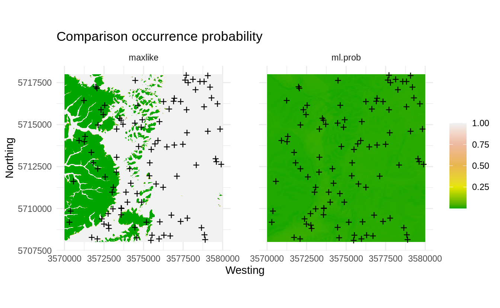
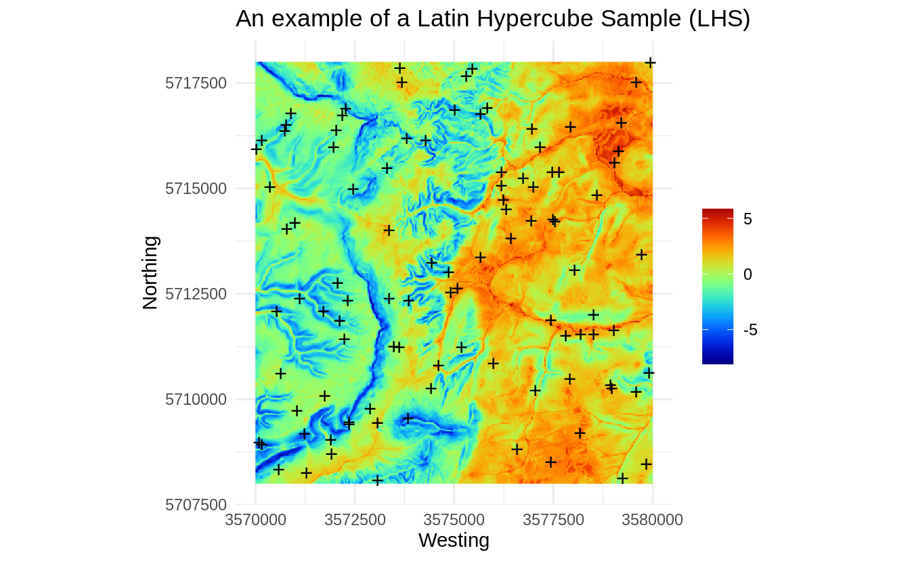

#  Generating spatial sampling

::: {.rmdnote}
You are reading the work-in-progress Spatial Sampling and Resampling for Machine Learning. This chapter is currently currently draft version, a peer-review publication is pending. You can find the polished first edition at <https://opengeohub.github.io/spatial-sampling-ml/>.
:::


## Spatial sampling algorithms of interest

This chapter reviews some common approaches for preparing point samples for a 
study area that you are visiting for the first time and/or no previous samples or 
models are available. We focus on the following spatial sampling methods: 

- Subjective or convenience sampling,
- Simple Random Sampling (**SRS**) [@Brus2021sampling],
- Latin Hypercube Sampling (**LHS**) and its variants e.g. Conditioned LHS [@minasny2006conditioned;@Malone2019PeerJ],
- Feature Space Coverage Sampling (**FSCS**) [@Goerg2013] and fuzzy k-means clustering [@hastie2009elements],
- 2nd round sampling [@stumpf2017uncertainty],

Our interest is in producing predictions (maps) of the target variable by employing 
regression / correlation between the target variable and multitude of features 
(raster layers), and where various Machine Learning techniques are used for training.
Hence spatial sampling methods are only reviewing within this context.

Once we collect enough training points in an area we can overlay points and GIS 
layers to produce a **regression matrix** or **classification matrix**, and 
which can then be used in a Machine Learning framework to generate spatial predictions 
i.e. produce maps. For an introduction to Ensemble Machine Learning for 
Predictive Mapping please refer to [this tutorial](https://gitlab.com/openlandmap/spatial-predictions-using-eml).

## Ebergotzen dataset

To test various sampling and mapping algorithms, we can use the Ebergotzen 
dataset available also via the **plotKML** package [@hengl2015plotkml]:


```r
set.seed(100)
library(plotKML)
library(sp)
library(viridis)
#> Loading required package: viridisLite
library(raster)
library(ggplot2)
data("eberg_grid25")
gridded(eberg_grid25) <- ~x+y
proj4string(eberg_grid25) <- CRS("+init=epsg:31467")
```

This dataset is described in detail in @Bohner2008Hamburg. It is a soil survey 
dataset with ground observations and measurements of soil properties including soil 
types. The study area is a perfect square 10×10 km in size.

We have previously derived 2–3 additional DEM parameters directly using SAGA GIS 
and which we can add to the list of covariates:


```r
eberg_grid25 = cbind(eberg_grid25, readRDS("./extdata/eberg_dtm_25m.rds"))
names(eberg_grid25)
#>  [1] "DEMTOPx"        "HBTSOLx"        "TWITOPx"        "NVILANx"       
#>  [5] "eberg_dscurv"   "eberg_hshade"   "eberg_lsfactor" "eberg_pcurv"   
#>  [9] "eberg_slope"    "eberg_stwi"     "eberg_twi"      "eberg_vdepth"  
#> [13] "PMTZONES"
```

so a total of 11 layers from which two layers are factors (`HBTSOLx` and `PMTZONES`). 
Next, for further analysis, and to reduce data overlap we can convert all 
primary variables to (numeric) principal components using:


```r
eberg_spc = landmap::spc(eberg_grid25[-c(2,3)])
#> Converting PMTZONES to indicators...
#> Converting covariates to principal components...
```

which gives the a total of 14 PCs. The patterns reflect a combination of terrain 
variables, lithological discontinuities (`PMTZONES`) and surface vegetation (`NVILANx`):


```r
spplot(eberg_spc@predicted[1:3], col.regions=SAGA_pal[[1]])
```

<div class="figure" style="text-align: center">

<p class="caption">(\#fig:plot-spc)Principal Components derived using Ebergotzen dataset.</p>
</div>

## Simple Random Sampling

To generate a SRS with e.g. 100 points we can simply using the **sp** package:


```r
rnd <- spsample(eberg_grid25[1], type="random", n=100)
```


```r
plot(raster(eberg_spc@predicted[1]), col=SAGA_pal[[1]])
points(rnd, pch="+")
```

<div class="figure" style="text-align: center">

<p class="caption">(\#fig:eberg-srs)An example of a Simple Random Sample (SRS).</p>
</div>

This sample is generated purely based on the spatial domain, the feature space 
is completely ignored / not taken into account, hence we can check how well do 
these points represent the feature space using a density plot:


```r
ov.rnd = sp::over(rnd, eberg_spc@predicted[,1:2])
library(hexbin)
library(grid)
reds = colorRampPalette(RColorBrewer::brewer.pal(9, "YlOrRd")[-1])
hb <- hexbin(eberg_spc@predicted@data[,1:2], xbins=60)
p <- plot(hb, colramp = reds, main='PCA Ebergotzen SRS')
pushHexport(p$plot.vp)
grid.points(ov.rnd[,1], ov.rnd[,2], pch="+")
```

<div class="figure" style="text-align: center">

<p class="caption">(\#fig:eberg-fs)Distribution of the SRS points from the previous example in the feature space.</p>
</div>

Visually, we do not directly see from Fig. \@ref(fig:eberg-fs) that the generated SRS 
maybe misses some important feature space, however if we zoom in, then we can see that some 
parts of feature space with high density (in this specific randomization) are somewhat 
under-represented. Imagine if we reduce number of sampling points then we run 
even higher risk of missing some areas in the feature space by using SRS.

Next we are interested to evaluate what is the occurrence probability of 
the SRS points based on the PCA components. To derive the occurrence probability we can use 
the **maxlike** package method [@Royle2012]:


```r
fm.cov <- stats::as.formula(paste("~", paste(names(eberg_spc@predicted[1:4]), collapse="+")))
ml <- maxlike::maxlike(formula=fm.cov, rasters=raster::stack(eberg_spc@predicted[1:4]), 
                       points=rnd@coords, method="BFGS", removeDuplicates=TRUE, savedata=TRUE)
ml.prob <- predict(ml)
```


```r
plot(ml.prob)
points(rnd@coords, pch="+")
```

<div class="figure" style="text-align: center">

<p class="caption">(\#fig:eberg-maxlike)Occurrence probability for SRS derived using the maxlike package.</p>
</div>

Note: for the sake of reducing the computing intensity we focus on the first four PCs. 
In practice, feature space analysis can be quite computational and we recommend using 
parallelized versions within an High Performance Computing environments to run such analysis.

Fig. \@ref(fig:eberg-maxlike) shows that, by accident, some parts of the feature 
space might be somewhat under-represented (areas with low probability of occurrence). 
Note however that occurrence probability for this dataset is overall _very_ low (<0.05), 
which indicates that distribution of points is not much correlated with the features, 
hence this specific SRS is probably satisfactory also for feature space analysis. 
The SRS points do not seem to group (by accident) and hence maxlike gives very low 
probability of occurrence.

We can repeat SRS many times and then see if the clustering of points gets more 
problematic, but as you can image, in practice for large number of samples it is 
a good chance that all features would get well represented also in the feature 
space. 

We can now also load the actual points collected for the Ebergotzen case study:


```r
data(eberg)
eberg.xy <- eberg[,c("X","Y")]
coordinates(eberg.xy) <- ~X+Y
proj4string(eberg.xy) <- CRS("+init=epsg:31467")
ov.xy = sp::over(eberg.xy, eberg_grid25[1])
eberg.xy = eberg.xy[!is.na(ov.xy$DEMTOPx),]
sel <- sample.int(length(eberg.xy), 100)
eberg.smp = eberg.xy[sel,]
```

To quickly estimate spread of points in geographical and feature spaces, we can 
also use the function `spsample.prob` that calls both the kernel density function 
from the **spatstat** package, and derives the probability of occurrence using the 
**maxlike** package: 


```r
iprob <- landmap::spsample.prob(eberg.smp, eberg_spc@predicted[1:4])
#> Deriving kernel density map using sigma 1010 ...
#> Deriving inclusion probabilities using MaxLike analysis...
```

In this specific case, the actual sampling points are much more clustered, so if we plot 
the two occurrence probability maps next to each other we get:


```r
op <- par(mfrow=c(1,2))
plot(raster(iprob$maxlike), zlim=c(0,1))
points(eberg.smp@coords, pch="+")
plot(ml.prob, zlim=c(0,1))
points(rnd@coords, pch="+")
par(op)
```

<div class="figure" style="text-align: center">

<p class="caption">(\#fig:eberg-maxlike2)Comparison occurrence probability for actual and SRS samples derived using the maxlike package.</p>
</div>

The map on the left clearly indicates that most of the sampling points are 
basically in the plain area and the hills are systematically under-sampled. This 
we can also cross-check by reading the description of the dataset in @Bohner2008Hamburg:

- the Ebergotzen soil survey points focus on agricultural land only,  
- no objective sampling design has been used, hence some points are clustered,  

This is also clearly visible from the _feature map_ plot where one part of the feature 
space seem to completely omitted from sampling:


```r
ov2.rnd = sp::over(eberg.smp, eberg_spc@predicted[,1:2])
p <- plot(hb, colramp = reds, main='PCA Ebergotzen actual')
pushHexport(p$plot.vp)
grid.points(ov2.rnd[,1], ov2.rnd[,2], pch="+")
```

<div class="figure" style="text-align: center">

<p class="caption">(\#fig:eberg-fs2)Distribution of the actual survey points from the previous example displayed in the feature space.</p>
</div>

## Latin Hypercube Sampling

In the previous example we have shown how to implement SRS and then also evaluate it 
against feature layers. Often SRS represent very well SRS so it can be directly used for 
Machine Learning and with a guarantee of not making too much bias in predictions. 
To avoid, however, risk of missing out some parts of the feature space, and also 
to try to optimize allocation of points, we can generate a sample using the 
**[Latin Hypercube Sampling](https://en.wikipedia.org/wiki/Latin_hypercube_sampling)** (LHS) method. In a nutshell, LHS methods are based on 
dividing the **Cumulative Density Function** (CDF) into _n_ equal partitions, and 
then choosing a random data point in each partition, consequently:

- CDF of LHS samples matches the CDF of population (unbiased representation),  
- Extrapolation in the feature space should be minimized,  

Latin Hypercube and sampling optimization using LHS is explained in detail in @minasny2006conditioned 
and @shields2016generalization. The [lhs package](https://github.com/bertcarnell/lhs) 
also contains numerous examples of how to implement for (non-spatial) data.

Here we use an implementation of the LHS available in the **clhs** package [@Roudier2011]:


```r
library(clhs)
rnd.lhs = clhs::clhs(eberg_spc@predicted[1:4], size=100, iter=100, progress=FALSE)
```

This actually implements the so-called _“Conditional LHS"_ [@minasny2006conditioned], 
and can get quite computational for large stack of rasters, hence we manually limit the 
number of iterations to 100.

We can plot the LHS sampling plan:


```r
plot(raster(eberg_spc@predicted[1]), col=SAGA_pal[[1]])
points(rnd.lhs@coords, pch="+")
```

<div class="figure" style="text-align: center">

<p class="caption">(\#fig:eberg-clhs)An example of a Latin Hypercube Sample (LHS).</p>
</div>


```r
p <- plot(hb, colramp = reds, main='PCA Ebergotzen actual')
pushHexport(p$plot.vp)
grid.points(rnd.lhs$PC1, rnd.lhs$PC2, pch="+")
```

<div class="figure" style="text-align: center">

<p class="caption">(\#fig:eberg-lhs2)Distribution of the LHS points from the previous example displayed in the feature space.</p>
</div>

Although in principle we might not see any difference in the point pattern between 
SRS and LHS, the feature space plot clearly shows that LHS covers systematically 
feature space map, i.e. we would have a relatively low risk of missing out some 
important features as compared to Fig. \@ref(fig:eberg-fs2).

Thus the main advantages of the LHS are:

- it ensures that feature space is represented systematically i.e. it is optimized 
  for Machine Learning using the specific feature layers;  
- it is an **[Independent Identically Distributed (IID)](https://xzhu0027.gitbook.io/blog/ml-system/sys-ml-index/learning-from-non-iid-data)** sampling design;  
- thanks to the clhs package, also the survey costs can be integrated to still 
  keep systematic spread, but reduce survey costs as much as possible [@roudier2012conditioned];  

## Feature Space Coverage Sampling

The **Feature Space Coverage Sampling** (FSCS) is described in detail in @BRUS2019464.
In a nutshell, FSCS aims at optimal coverage of the feature space which is achieved 
by minimizing the average distance of the population units (raster cells) to the 
nearest sampling units in the feature space represented by the raster layers [@ma2020comparison].

To produce FSCS point sample we can use function `kmeanspp` of package **LICORS** [@Goerg2013].
First we partition the feature space cube to e.g. 100 clusters. We then select raster cells 
with the shortest scaled Euclidean distance in covariate-space to the centres of 
the clusters as the sampling units:


```r
library(LICORS)
library(fields)
fscs.clust <- kmeanspp(eberg_spc@predicted@data[,1:4], k=100, iter.max=100)
D <- fields::rdist(x1 = fscs.clust$centers, x2 = eberg_spc@predicted@data[,1:4])
units <- apply(D, MARGIN = 1, FUN = which.min)
rnd.fscs <- eberg_spc@predicted@coords[units,]
```

Note: the k-means++ algorithm is of most interest for small sample sizes: _“for large 
sample sizes the extra time needed for computing the initial centres can become 
substantial and may not outweigh the larger number of starts that can be afforded 
with the usual k-means algorithm for the same computing time”_ [@Brus2021sampling].
The `kmeanspp` algorithm from the LICORS package is unfortunately quite computational 
and is in principle not recommended for large grids / to generate large number of 
samples. Instead, we recommend clustering feature space using the `h2o.kmeans` function 
from the [h2o 
package](https://docs.h2o.ai/h2o/latest-stable/h2o-docs/data-science/k-means.html), 
which is also suitable for larger datasets with computing running in parallel:


```r
library(h2o)
h2o.init(nthreads = -1)
#> 
#> H2O is not running yet, starting it now...
#> 
#> Note:  In case of errors look at the following log files:
#>     /tmp/RtmpK1uE9B/file188d6008dd79/h2o_tomislav_started_from_r.out
#>     /tmp/RtmpK1uE9B/file188d330618a3/h2o_tomislav_started_from_r.err
#> 
#> 
#> Starting H2O JVM and connecting: .. Connection successful!
#> 
#> R is connected to the H2O cluster: 
#>     H2O cluster uptime:         2 seconds 56 milliseconds 
#>     H2O cluster timezone:       Europe/Amsterdam 
#>     H2O data parsing timezone:  UTC 
#>     H2O cluster version:        3.30.0.1 
#>     H2O cluster version age:    1 year, 9 months and 1 day !!! 
#>     H2O cluster name:           H2O_started_from_R_tomislav_vru837 
#>     H2O cluster total nodes:    1 
#>     H2O cluster total memory:   15.71 GB 
#>     H2O cluster total cores:    32 
#>     H2O cluster allowed cores:  32 
#>     H2O cluster healthy:        TRUE 
#>     H2O Connection ip:          localhost 
#>     H2O Connection port:        54321 
#>     H2O Connection proxy:       NA 
#>     H2O Internal Security:      FALSE 
#>     H2O API Extensions:         Amazon S3, XGBoost, Algos, AutoML, Core V3, TargetEncoder, Core V4 
#>     R Version:                  R version 4.0.2 (2020-06-22)
#> Warning in h2o.clusterInfo(): 
#> Your H2O cluster version is too old (1 year, 9 months and 1 day)!
#> Please download and install the latest version from http://h2o.ai/download/
df.hex <- as.h2o(eberg_spc@predicted@data[,1:4], destination_frame = "df")
#> 
  |                                                                            
  |                                                                      |   0%
  |                                                                            
  |======================================================================| 100%
km.nut <- h2o.kmeans(training_frame=df.hex, k=100, keep_cross_validation_predictions = TRUE)
#> 
  |                                                                            
  |                                                                      |   0%
  |                                                                            
  |=======                                                               |  10%
  |                                                                            
  |======================================================================| 100%
#km.nut
```

Note: in the example above, we have manually set the number of clusters to 100, 
but the number of clusters could be also derived using some optimization procedure. 
Next, we predict the clusters and plot the output:


```r
m.km <- as.data.frame(h2o.predict(km.nut, df.hex, na.action=na.pass))
#> 
  |                                                                            
  |                                                                      |   0%
  |                                                                            
  |======================================================================| 100%
```

We can save the class centers (if needed for any further analysis):


```r
class_df.c = as.data.frame(h2o.centers(km.nut))
names(class_df.c) = names(eberg_spc@predicted@data[,1:4])
str(class_df.c)
#> 'data.frame':	100 obs. of  4 variables:
#>  $ PC1: num  1.924 -1.797 -2.893 -6.655 -0.652 ...
#>  $ PC2: num  0.426 2.696 -4.387 1.253 -1.986 ...
#>  $ PC3: num  -0.919 5.743 -3.771 -0.47 2.383 ...
#>  $ PC4: num  0.0892 4.7985 -2.7772 2.0332 1.0733 ...
#write.csv(class_df.c, "NCluster_100_class_centers.csv")
```

To select sampling points we use the minimum distance to class centers [@Brus2021sampling]:


```r
D <- fields::rdist(x1 = class_df.c, x2 = eberg_spc@predicted@data[,1:4])
units <- apply(D, MARGIN = 1, FUN = which.min)
rnd.fscs <- eberg_spc@predicted@coords[units,]
```


```r
plot(raster(eberg_spc@predicted[1]), col=SAGA_pal[[1]])
points(rnd.fscs, pch="+")
```

<div class="figure" style="text-align: center">

<p class="caption">(\#fig:eberg-fscs)An example of a Feature Space Coverage Sampling (FSCS).</p>
</div>

Visually, FSCS seem to add higher spatial density of points in areas where there 
is higher complexity. So the `h2o.kmeans` algorithm stratifies area into most 
possible homogeneous units (in the example above, large plains in the right 
part of the study area are relatively homogeneous, hence the sampling intensity 
in geographical space drops significantly), and the points are then allocated per 
each strata.


```r
p <- plot(hb, colramp = reds, main='PCA Ebergotzen FSCS')
pushHexport(p$plot.vp)
grid.points(eberg_spc@predicted@data[units,"PC1"], eberg_spc@predicted@data[units,"PC2"], pch="+")
```

<div class="figure" style="text-align: center">

<p class="caption">(\#fig:eberg-fscs-pnts)Distribution of the FSCS points from the previous example displayed in the feature space.</p>
</div>

The FSCS sampling pattern in feature space looks almost as grid sampling in feature 
space. FSCS seems to put more effort on sampling at the edges on the feature space 
in comparison to LHS and SRS, and hence can be compared to classical response 
surface designs such as [D-optimal designs](https://en.wikipedia.org/wiki/Optimal_design) [@Hengl2004AJSR].


```r
h2o.shutdown(prompt = FALSE)
```

## Summary points

In the previous examples we have shown differences between SRS, LHS and FSCS.
SRS and LHS are IID sampling methods and as long as the number of samples is large 
and the study area is complex, it is often difficult to notice or quantify any under- or 
over-sampling. Depending on which variant of FSCS we implement, FSCS can result in 
higher spatial spreading especially if a study area consists of a combination 
of a relatively homogeneous and complex terrain units.

The Ebergotzen dataset (existing point samples) clearly shows that the _“convenience surveys”_ can 
show significant clustering and under-representation of feature space 
(Fig. \@ref(fig:eberg-fs2)). Consequently, these sampling bias could lead to:

- _Bias in estimating regression parameters_ i.e. overfitting;  
- _Extrapolation problems_ due to under-representation of feature space;  
- _Bias_ in estimating population parameters of the target variable;  

The first step to deal with these problems is to detect them, second is to try 
to implement a strategy that prevents from overfitting. Some possible approaches 
are addressed in the second part of the tutorial.

LHS and FSCS are recommended sampling methods if the purpose of sampling is to 
build regression or classification models using multitude of (terrain, 
climate, land cover etc) covariate layers. @ma2020comparison compared LHS to FSCS 
for mapping soil types and concluded that FSCS results in better mapping accuracy, 
most likely because FSCS spreads points better in feature space and hence in 
their case studies that seem to have helped with producing more accurate predictions.
@yang2020evaluation also report that LHS helps improve accuracy only for the large size of points.

The `h2o.kmeans` algorithm is suited for large datasets, but nevertheless to 
generate >>100 clusters using large number of raster layers could become RAM 
consuming and is maybe not practical for operational sampling. An alternative 
would be to reduce number of clusters and select multiple points per cluster.

In the case of doubt which method to use LHS or FSCS, we recommend the following 
simple rules of thumb: 

- If your dataset contains relatively smaller-size rasters and the targeted number of sampling 
   points is relatively small (e.g. <<1000), we recommend using the FSCS algorithm;  
- If your project requires large number of sampling points (>>100), then you should probably 
  consider using the LHS algorithm;  

In general, as the number of sampling points starts growing, differences between 
SRS (no feature space) and LHS becomes minor, which can also be witnessed 
visually (basically it becomes difficult to tell the difference between the two). 
SRS could, however, by accident miss some important parts of the feature space, 
so in principle it is still important to use either LHS or FSCS algorithms to 
prepare sampling locations for ML where objective is to fit regression and/or 
classification models using ML algorithms.

To evaluate potential sampling clustering and pin-point under-represented areas 
one can run multiple diagnostics:

1. In _geographical space_: 
   (a) [kernel density analysis](https://rdrr.io/cran/spatstat.core/man/density.ppp.html) using the spatstat package, then determine if some parts of the study area have systematically higher density;  
   (b) testing for **Complete Spatial Randomness** [@schabenberger2005statistical] using e.g. [spatstat.core::mad.test](https://rdrr.io/cran/spatstat.core/man/dclf.test.html) and/or [dbmss::Ktest](https://rdrr.io/cran/dbmss/man/Ktest.html);  
2. In _feature space_: 
   (a) occurrence probability analysis using the [maxlike package](https://rdrr.io/github/rbchan/maxlike/man/maxlike-package.html);
   (b) unsupervised clustering of the feature space using e.g. `h2o.kmeans`, then determining if 
   any of the clusters are significantly under-represented / under-sampled;  
   (c) estimating **Area of Applicability** based on similarities between training 
   prediction and feature spaces [@meyer2021predicting];  

Plotting generated sampling points both on a map and _feature space map_ helps 
detect possible extrapolation problems (Fig. \@ref(fig:eberg-fs2)). If you detect 
problems in feature space representation based on the an existing point sampling set, 
you can try to reduce those problems by adding additional samples e.g. through 
**covariate space infill sampling** [@Brus2021sampling] or through 2nd round 
sampling and then re-analysis. These methods are discussed in further chapters.
