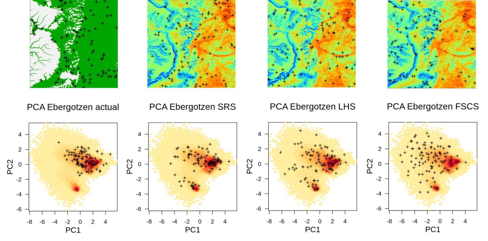

# Summary notes

::: {.rmdnote}
You are reading the work-in-progress Spatial Sampling and Resampling for Machine Learning. This chapter is currently currently draft version, a peer-review publication is pending. You can find the polished first edition at <https://opengeohub.github.io/spatial-sampling-ml/>.
:::

## Which sampling algorithm to choose?

In this tutorial we have demonstrated some main steps required to analyze 
existing sample designs (point patterns) and compare them with sampling algorithms 
such as the SRC, LHS and FSCS. Some general conclusions are:

- Understanding limitations of spatial samples used for ML is important. Diversity of tools 
  now exist that allow for sampling diagnostics, especially to determine spatial 
  clustering, potential extrapolation areas, to test Complete Spatial Randomness etc;  
- Ensemble Machine Learning is at the order of magnitude more computational, but 
  using combination of simple and complex base learners and spatial blocking seem to 
  help produce models with less artifacts in extrapolation space and which report 
  a more realistic mapping accuracy than if spatial clustering is ignored;  
- The **[forestError](https://rdrr.io/cran/forestError/)** package seems to provide a complete framework for uncertainty 
  assessment and can be used to derive the prediction errors (RMSPE) _per-pixel_ 
  i.e. for each new prediction location; the average prediction error 
  of the whole area is the mean prediction error that one can report to the users 
  as the best unbiased estimate of the mean uncertainty;  

Figure below shows differences between the above mentioned sampling algorithms 
in both geographical and feature spaces. In this case: actual sampling is 
significantly missing the whole cluster in feature space, while FSCS seems to 
show the highest spread in the feature space and by many authors is recognized 
as the most advantageous sampling design for predictive mapping [@ma2020comparison]. 
Such sampling diagnostics / comparisons geographical vs feature space help us 
detect any possible problems before we start running ML.

(\#fig:summary-eberg)Summary comparison of sampling designs: convenience sampling (actual), Simple Random Sample (SRS), Latin Hypercube Sampling (LHS), and Feature Space Coverage Sampling (FSCS). Points shown in geographical (above) and feature space (below; with first 2 principal components as x, y coordinates).

## Sampling in a new area

Recommended steps to prepare a sampling plan include:

1.  Prepare all covariate layers (rasters) that you plan to use to fit
    predictive mapping models; import them to R;
2.  Convert covariate layers to Principal Components using the
    **[landmap::spc](https://rdrr.io/cran/landmap/man/spc.html)**
    function;
3.  Cluster the feature space using the
    **[h2o.kmeans](https://docs.h2o.ai/h2o/latest-stable/h2o-docs/data-science/k-means.html)**
    function; for smaller number of samples use number of clusters equal
    to number of sampling locations;
4.  Generate a sampling design and export the points to **[GPX
    format](https://nl.wikipedia.org/wiki/GPS_Exchange_Format)** so they
    can be imported to a hand-held GPS or similar. For fieldwork we
    recommend using the **[ViewRanger
    app](https://play.google.com/store/apps/details?id=com.augmentra.viewranger.android&hl=en&gl=US)**
    which has useful functionality for field work including planning the
    optimal routes.

If you are collecting more than a few hundred points, then FSCS could
become cumbersome and we hence recommend using LHS sampling. This
sampling algorithm spreads points symmetrically in the feature space and
ensures that the extrapolation (in feature space) is minimized.

## ML on clustered point samples

Assuming that there is significant spatial and/or feature space clustering in 
training points, it appears that various blocking / Cross-Validation strategies, 
especially based on Ensemble ML help produce more balanced estimate of regression 
parameters and of the mapping accuracy. Incorporation of spatial proximity i.e. 
autocorrelation has roots in the **Generalized Least Squares methods** [@Venables2002Springer] 
and in the classical data science papers e.g. by @roberts2017cross. Ensemble ML 
with spatial blocking comes, however, at the costs of the order of magnitude 
higher computing costs.

In theory, even the most clustered point datasets can be used to fit predictive mapping models, 
however, it is then important to use modeling methods that account for clustering and 
prevent doing over-fitting and/or producing not realistic measures of mapping accuracy. 
Eventually, very biased point samples totally missing ≫50% of the feature / geographical 
space would be of limited use for producing predictions, but could still be used to 
get some initial estimates.  

@Wadoux2021EM shows that, assuming that training points are based on the probability 
sampling i.e. SRS, there is no need for spatial blocking i.e. regardless of the 
spatial dependence structure in the target variable, any subset of SRS would give an 
unbiased estimator of the mean population parameters. Many spatial statisticians 
hence argue that mapping accuracy can be determined only by collecting data 
using probability sampling [@Brus2011EJSS]. Indeed, we also recommend to users of these tutorials 
to try your best to generate sampling designs using LHS, FSCS or at least SRS, 
as this ensures unbiased derivation of population parameters. Here the book by 
@Brus2021sampling seems to be a valuable resource as it also provides 
[practical instructions](https://github.com/DickBrus/SpatialSamplingwithR) for a diversity of data types.

If you have a dataset that you have used to test sampling and resampling, please 
share your experiences by posting [an issue](https://github.com/OpenGeoHub/spatial-sampling-ml/) and/or providing a screenshot of your results.

# References
